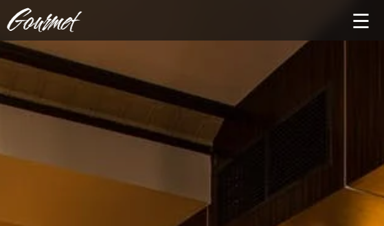
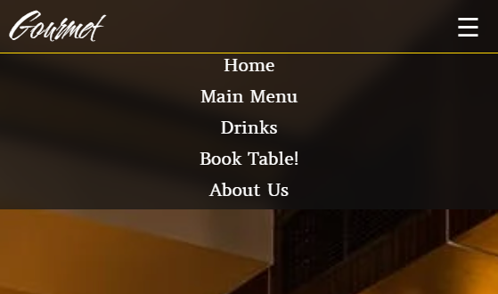
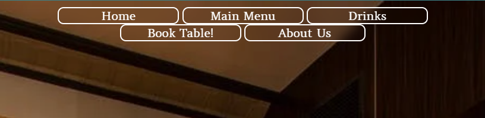
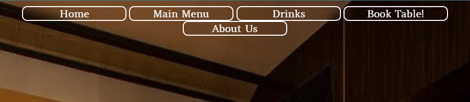
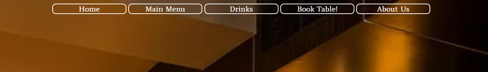
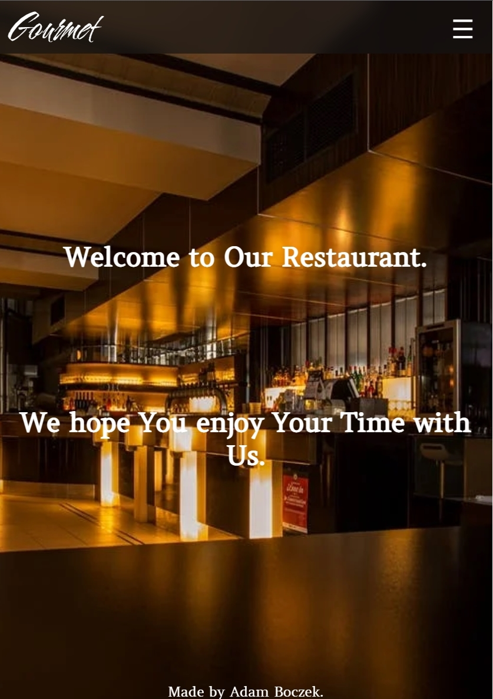

# Gourmet Restaurant Portfolio Project 1

This is protfolio project about Italian restaurant called Gourmet, it is designed to represent my journey through the project itself. You will be able to navigate through website on many devices from PC's to small portable devices without any problem.

## Table of content:

- [Motivation](#motivation)
- [User Experience](#user-experience-ux)
    - [User Stories](#user-stories)
    - [Website Goals](#website-goals)
    - [Requirements](#requirements)
    - [Expectations](#expectations)
    - [Design](#design)
    - [Wireframes](#wireframes)
        - [Desktop](#desktop)
        - [Tablet](#tablet)
        - [Mobile](#mobile)
- [Website Structure](#website-structure)
- [Technology, Frameworks and Programs used](#technology-frameworks-and-programs-used)
    - [Languages](#languages)
    - [Frameworks and programs used](#frameworks-and-programs-used)
- [Features](#features)
    - [Navigation bar](#navigation-bar)
- [Testing](#testing)
- [Deployment](#deployment)
- [Contributions](#contributions)
- [Credits](#credits)

# Motivation:

This project is about restaurant, menu and booking table. 
Main purpose of this project is to present landing page of the restaurant with menu, drinks, booking table and contact us/about us.

I chose this project over any other one is because how hard it is to get pictures without copyright on them. 
Wanted something nice and sleek.

# User Experience (UX)

## User Stories
 - User Story
    - As user visiting website I want you to understand what is the website about.
    - As user visiting website I want you to navigate easily through the website.
    - As user I want you to see landing page and navigate through it.
    - As user I want you to easily navigate to Main Menu.
    - As user I want you to easily navigate to Drinks Menu.
    - As user I want you to easily access Booking Table and successfully use it.
    - As user I want you to easily access About Us and successfully use it.
    - As user returning I want you to easily navigate through website as the first time without any issue even if there were any changes implemented. 

    

## Website Goals

- Increase customer number.
- Expand and grow as a business.

## Requirements

- Easy access on all kind of  devices without graphical bugs.
- Clear information about restaurants services.
- Readable menu.
- Simple ways to book table at the restaurant.
- Simple ways to contact us if necessary.

## Expectations

- Landing page to be nice and sleek.
- Food menu to be readable for everyone.
- Book tabel to work correctly.
- About Us to work correctly.

## Design

 - Colors:
    - Colors used on the website are:

        - Gold #ffd700;
            
            
        - White #ffffff;

            
        - #131313b0; 
        
            

    - Fonts:
        - Fonts used on website are [Cherish](https://fonts.google.com/specimen/Cherish?query=cherish) and Amethyst from google fonts. Cherish is used for logo itself and [Amethysta](https://fonts.google.com/specimen/Amethysta?query=amet) for buttons.
        - Backup fonts is sans-serif if main font cannot be loaded for any reason.

    - Images:
        - Image of [restaurant](https://www.pexels.com/photo/alcohol-architecture-bar-beer-260922/) used from pexels it is nice golden black colors which suit the website color design.

 [Back to top](#gourmet-restaurant-portfolio-project-1)
## Wireframes

### Desktop
- [Desktop Main Page](documentation/desktop.png)
- [Thank you page](documentation/thank-you-pc.png)

### Tablet
- [Tablet Main Page](documentation/Tablet.png)
- [Thank you page](documentation/thank-you-tablet.png)

### Mobile
- [Mobile Main Page](documentation/Mobile.png)
- [Thank you page](documentation/thank-you-mobile.png)

# Website structure

|  Screen size |  Breakpoint |
|---|---|
|x-small|<576px|
|small|>= 576px|
|medium|>= 768px|
|large|>= 992px|
|x-large|>= 1200px|

[Back to top](#gourmet-restaurant-portfolio-project-1)

# Technology, Frameworks and Programs used.

##  Languages

- [HTML](https://en.wikipedia.org/wiki/HTML5)

- [CSS](https://en.wikipedia.org/wiki/CSS)

## Frameworks and Programs used.

- [Pexels](https://www.pexels.com/)    
    - Pexels was used on background picture of entire website.

- [Google fonts](https://fonts.google.com/)
    - Google fonts was used to pick and import fonts to my project.
    
- [GitHub](https://github.com/)
    - GitHub was used to store my source code by git add . git commit and git push.

- [Git](https://gitpod.io/)
    - Git was used with GitPod to write down the code and push it to GitHub.
    
- [Balsamiq](https://balsamiq.com/)
    - Balsamiq was used to design the website idea itself.

- [screenfly](https://screenfly.org/)
    - Testing My website on it.

# Features

1. Responsive on all devices.
2. Interactive buttons
3. Book table.
4. Contact us.

## Navigation bar

 - Navigation bar will be mostly the same through out the website except for buttons they will be replaced with hamburger menu on mobile devices.

    - Mobile devices.

        - Hidden hamburger menu for mobiles.

            

        - Opened hamburger menu for mobiles.

            
    
    
    - Tablets.

        - Small Tablets 

            

        - Tablets

            

    - Desktop.

        - Desktops

            

- Main content of website will be nicely adjusted on all devices with pictures below:

    - Mobile devices.

        

    - Tablets.

        **picture**

    - Desktop.

        **picture**

- Booking table have required data to be filled in.
    (All forms have dummy link and wont send data to anyone)

    **picture**

- Thank you Website for Booking a Table!.

    **picture**

- Footer

    **picture**

[Back to top](#gourmet-restaurant-portfolio-project-1)

# Testing

Testing was done in W3C Markup Validator and W3C CSS Validator Services to make sure there is no markup errors in syntax.

1. Testing on website.
    - Website has been tested in Lighthouse, [Screenfly](https://screenfly.org/) and my own PC.

2. Testing on portable devices.
    - Website has been tested with Lighthouse, [Screenfly](https://screenfly.org/) and couple of mobile devices.

3. Known bugs.
    - Date and Time input is blank on mobile phones but not in Previews or Live website with Right Click **Inspect**.
    - Checkbox hamburger menu wont close itself requires **JavaScript** to uncheck to make it hide the menu items.

# Deployment
Following writing the code then commiting and pushing to GitHub, this project was deployed using GitHub by the following steps.

1. Navigate to the repository on github and click **Settings**.
2. Then select **Pages** on the side navigation.
3. Select the None dropdown, and then click **Main**.
4. Click on the **Save** button.
5. Now the website is now live on 
6. If any changes are required, they can be done, commited and pushed to GitHub and the changes will be updated.

# Contributions:

# Credits:

- Slack Community and my Mentor!
- [Simen Daehlin](https://github.com/Eventyret) My Mentor very Helpfull!
- [Pexels](http.//www.pexels.com) For free pictures.
- [Delish](https://www.delish.com/) for food ideas!.
- [Lacucinaitaliana](https://www.lacucinaitaliana.com/) for food ideas!.
- [bbcgoodfood](https://www.bbcgoodfood.com/) for drinks ingredients.
- [Google Maps](https://www.google.com/maps/) for google maps.
- [screenfly](https://screenfly.org/) for testing my website ;).
- [The W3C Markup Validation Service](https://validator.w3.org/) Validation of HTML.
- [The W3C CSS Validation Service](https://jigsaw.w3.org/css-validator/) Validation of CSS.

[Back to top](#gourmet-restaurant-portfolio-project-1)