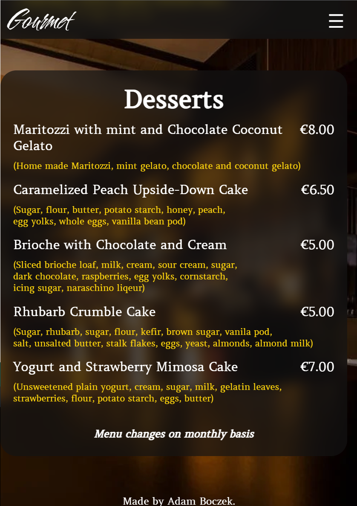
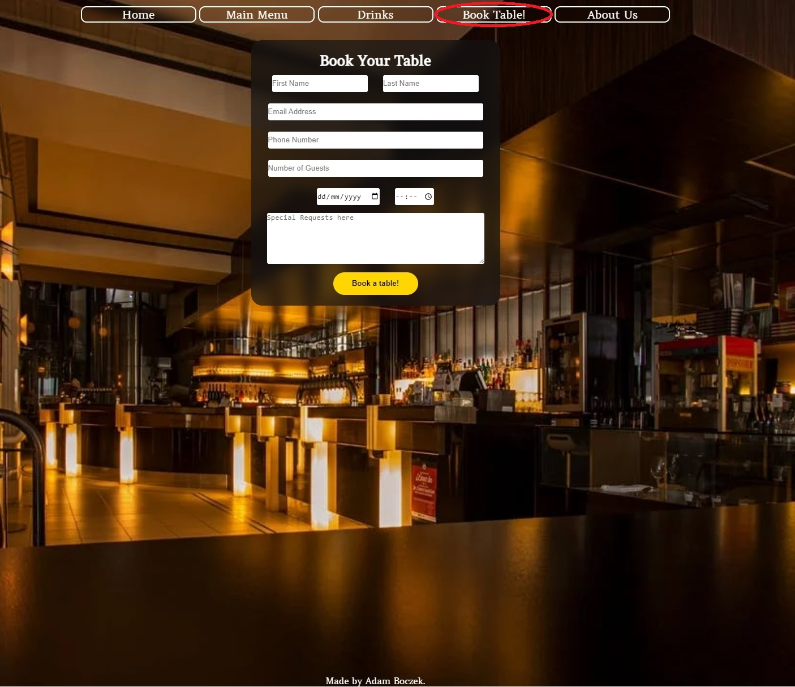

# Gourmet Restaurant Portfolio Project 1

This is protfolio project about Italian restaurant called Gourmet, it is designed to represent my journey through the project itself. You will be able to navigate through website on many devices from PC's to small portable devices without any problem.

## Table of content:

- [Motivation](#motivation)
- [User Experience](#user-experience-ux)
    - [User Stories](#user-stories)
    - [Website Goals](#website-goals)
    - [Requirements](#requirements)
    - [Expectations](#expectations)
    - [Design](#design)
    - [Wireframes](#wireframes)
        - [Desktop](#desktop)
        - [Tablet](#tablet)
        - [Mobile](#mobile)
- [Website Structure](#website-structure)
- [Technology, Frameworks and Programs used](#technology-frameworks-and-programs-used)
    - [Languages](#languages)
    - [Frameworks and programs used](#frameworks-and-programs-used)
- [Features](#features)
    - [Navigation bar](#navigation-bar)
- [Testing](#testing)
- [Testing user stories](#testing-user-stories)
- [Deployment](#deployment)
- [Credits](#credits)

# Motivation:

This project is about restaurant, menu and booking table. 
Main purpose of this project is to present landing page of the restaurant with menu, drinks, booking table and contact us/about us.

I chose this project over any other one is because how hard it is to get pictures without copyright on them. 
Wanted something nice and sleek.

# User Experience (UX)

## User Stories
 - User Story
    - As user visiting website I want you to understand what is the website about.
    - As user visiting website I want you to navigate easily through the website.
    - As user I want you to see landing page and navigate through it.
    - As user I want you to easily navigate to Main Menu.
    - As user I want you to easily navigate to Drinks Menu.
    - As user I want you to easily access Booking Table and successfully use it.
    - As user I want you to fill in your details in Booking form to succesfully book a table.
    - As user I want you to easily access About Us and successfully use it.
    - As user I want you be able to use map in About us section.
    - As user I want you to see Thank you page after booking table. 

## Website Goals

- Increase customer number.
- Expand and grow as a business.

## Requirements

- Easy access on all kind of  devices without graphical bugs.
- Clear information about restaurants services.
- Readable menu.
- Simple ways to book table at the restaurant.
- Simple ways to contact us if necessary.

## Expectations

- Landing page to be nice and sleek.
- Food menu to be readable for everyone.
- Book tabel to work correctly.
- About Us to work correctly.

## Design

 - Colors:
    - Colors used on the website are:

        - Gold #ffd700;
            
            
        - White #ffffff;

            
        - #131313b0; 
        
            

    - Fonts:
        - Fonts used on website are [Cherish](https://fonts.google.com/specimen/Cherish?query=cherish) and Amethyst from google fonts. Cherish is used for logo itself and [Amethysta](https://fonts.google.com/specimen/Amethysta?query=amet) for buttons.
        - Backup fonts is sans-serif if main font cannot be loaded for any reason.

    - Images:
        - Image of [restaurant](https://www.pexels.com/photo/alcohol-architecture-bar-beer-260922/) used from pexels it is nice golden black colors which suit the website color design.

 [Back to top](#gourmet-restaurant-portfolio-project-1)
## Wireframes

### Desktop
- [Desktop Main Page](documentation/wireframes/desktop.png)
- [Thank you page](documentation/wireframes/thank-you-pc.png)

### Tablet
- [Tablet Main Page](documentation/wireframes/Tablet.png)
- [Thank you page](documentation/wireframes/thank-you-tablet.png)

### Mobile
- [Mobile Main Page](documentation/wireframes/Mobile.png)
- [Thank you page](documentation/wireframes/thank-you-mobile.png)

# Website structure

|  Screen size |  Breakpoint |
|---|---|
|small|>= 576px|
|medium|>= 768px|
|large|>= 1024px|

[Back to top](#gourmet-restaurant-portfolio-project-1)

# Technology, Frameworks and Programs used.

##  Languages

- [HTML](https://en.wikipedia.org/wiki/HTML5)

- [CSS](https://en.wikipedia.org/wiki/CSS)

## Frameworks and Programs used.

- [Pexels](https://www.pexels.com/)    
    - Pexels was used on background picture of entire website.

- [Google fonts](https://fonts.google.com/)
    - Google fonts was used to pick and import fonts to my project.
    
- [GitHub](https://github.com/)
    - GitHub was used to store my source code by git add . git commit and git push.

- [Git](https://gitpod.io/)
    - Git was used with GitPod to write down the code and push it to GitHub.
    
- [Balsamiq](https://balsamiq.com/)
    - Balsamiq was used to design the website idea itself.

- [screenfly](https://screenfly.org/)
    - Testing My website on it.

# Features

1. Responsive on all devices.
2. Interactive buttons
3. Book table.
4. Contact us.

## Navigation bar

 - Navigation bar will be mostly the same through out the website except for buttons they will be replaced with hamburger menu on mobile devices.

    - Mobile devices.

        - Hidden hamburger menu for mobiles.

            

        - Opened hamburger menu for mobiles.

            
    
    
    - Tablets.

        - Small Tablets 

            

        - Tablets

            

    - Desktop.

        - Desktops

            

- Main content of website will be nicely adjusted on all devices with pictures below:

    - Mobile devices.

        

        

        

        

        

        

        

        

        

        

        [Back to top](#gourmet-restaurant-portfolio-project-1)

    - Tablets.

        

        

        

        

        

        

        

        

        

        

    [Back to top](#gourmet-restaurant-portfolio-project-1)

    - Desktop.

        

        

        

        

        

        

        

        

        

        

        [Back to top](#gourmet-restaurant-portfolio-project-1)

- Thank you Website for Booking a Table!.

    - Mobile

        
    - Tablet 

        
    - Desktop

        

- Footer
    - Footer looks the same on all devices just space around is wider.

    

[Back to top](#gourmet-restaurant-portfolio-project-1)

# Testing

1. W3C HTML Validator and CSS Validator

    - HTML Validator
    
        - Main Page and Thank you

        

    - CSS Validator

        - CSS 

        

2. Testing on website.
    - Website has been tested in Lighthouse, [Screenfly](https://screenfly.org/) and my own PC.

        - Mobile Lighthouse score

        

        - Desktop Lighthouse score

        

3. Testing on portable devices.
    - Website has been tested with Lighthouse, [Screenfly](https://screenfly.org/) and couple of mobile devices.

        - Screenfly website.

            

4. Known bugs.
    - Date and Time input is blank on mobile phones but not in Previews or Live website with Right Click **Inspect**.
    - Checkbox hamburger menu wont close itself requires **JavaScript** to uncheck to make it hide the menu items.

# Testing user stories

- As user visiting website I want you to understand what is the website about.

| **Feature**                     | **Action**                          | **Expected Result**                                                                  | **Result** |
|---------------------------------|-------------------------------------|--------------------------------------------------------------------------------------|-------------------|
| User understands whats the website is about | User can see first section of website| User can see that website is about restaurant | PASS              |

Picture

 

- As user visiting website I want you to navigate easily through the website.

| **Feature**                     | **Action**                          | **Expected Result**                                                                  | **Result** |
|---------------------------------|-------------------------------------|--------------------------------------------------------------------------------------|-------------------|
| User can navigate though website easily | User can see navigation bar| User can press buttons and will be brought to certain parts of page | PASS              |

Picture

 

- As user I want you to see landing page and navigate through it.

| **Feature**                     | **Action**                          | **Expected Result**                                                                  | **Result** |
|---------------------------------|-------------------------------------|--------------------------------------------------------------------------------------|-------------------|
| User see landing page and can navigate through it | User can see landing page and navigation bar| User can see landing page and navigation bar and use it to navigate through it easily | PASS              |

Picture

 

- As user I want you to easily navigate to Main Menu.

| **Feature**                     | **Action**                          | **Expected Result**                                                                  | **Result** |
|---------------------------------|-------------------------------------|--------------------------------------------------------------------------------------|-------------------|
| User see Main menu button | User can press on Main menu button | User will land on Food menu section| PASS              |

Picture

 

- As user I want you to easily navigate to Drinks Menu.

| **Feature**                     | **Action**                          | **Expected Result**                                                                  | **Result** |
|---------------------------------|-------------------------------------|--------------------------------------------------------------------------------------|-------------------|
| User see Drinks menu button | User can press on Drinks menu button | User will land on Drinks menu section | PASS              |

Picture

 

- As user I want you to fill in your details in Booking form to succesfully book a table.

| **Feature**                     | **Action**                          | **Expected Result**                                                                  | **Result** |
|---------------------------------|-------------------------------------|--------------------------------------------------------------------------------------|-------------------|
| User see form and fills it in | User can fill in the form to book a table | User will be able to press on book a table button without showing required | PASS              |

Picture

 

- As user I want you to easily access Booking Table and successfully use it.

| **Feature**                     | **Action**                          | **Expected Result**                                                                  | **Result** |
|---------------------------------|-------------------------------------|--------------------------------------------------------------------------------------|-------------------|
| User see Book table button | User can press on Book table button | User will land on Book table form section | PASS              |

Picture

 

- As user I want you to easily access About Us and successfully use it.

| **Feature**                     | **Action**                          | **Expected Result**                                                                  | **Result** |
|---------------------------------|-------------------------------------|--------------------------------------------------------------------------------------|-------------------|
| User see About us button | User can press on About us button | User will land on About us section | PASS              |

Picture

 

- As user I want you be able to use map in About us section.

| **Feature**                     | **Action**                          | **Expected Result**                                                                  | **Result** |
|---------------------------------|-------------------------------------|--------------------------------------------------------------------------------------|-------------------|
| User see map | User can use map to locate the restaurant if needed | User will find where restaurant is located if needed | PASS              |

Picture

 

- As user I want you to see Thank you page after booking table. 

| **Feature**                     | **Action**                          | **Expected Result**                                                                  | **Result** |
|---------------------------------|-------------------------------------|--------------------------------------------------------------------------------------|-------------------|
| User see Thank you page | User can see Thank you page and return to main page | User will see Thank you page thanking them for booking and be able to return to main page | PASS              |

Picture

 

# Deployment
Following writing the code then commiting and pushing to GitHub, this project was deployed using GitHub by the following steps.

1. Navigate to the repository on github and click **Settings**.
2. Then select **Pages** on the side navigation.
3. Select the None dropdown, and then click **Main**.
4. Click on the **Save** button.
5. Now the website is now live on 
6. If any changes are required, they can be done, commited and pushed to GitHub and the changes will be updated.

# Credits:

- Slack Community and my Mentor!
- [Simen Daehlin](https://github.com/Eventyret) My Mentor very Helpfull!
- [Pexels](http.//www.pexels.com) For free pictures.
- [Delish](https://www.delish.com/) for food ideas!.
- [Lacucinaitaliana](https://www.lacucinaitaliana.com/) for food ideas!.
- [bbcgoodfood](https://www.bbcgoodfood.com/) for drinks ingredients.
- [Google Maps](https://www.google.com/maps/) for google maps.
- [screenfly](https://screenfly.org/) for testing my website ;).
- [The W3C Markup Validation Service](https://validator.w3.org/) Validation of HTML.
- [The W3C CSS Validation Service](https://jigsaw.w3.org/css-validator/) Validation of CSS.
- [AmIresponsive](https://ui.dev/amiresponsive) for responsive look of my website.
- [Autoprefixer](https://autoprefixer.github.io/) used to prefix CSS.

[Back to top](#gourmet-restaurant-portfolio-project-1)